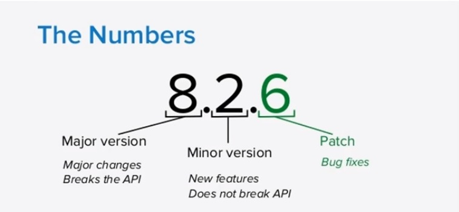

# Babel & Webpack

## Instructions

- Install dependencies - `npm install`
- Start the server - `npm start`
- Navigate to `localhost:3500` in the browser
- Enjoy!

## Content

- Webpack 4
- ES6 support
- Sass support
- Hot Module Reload - browser reloads whenever a js or scss file changes

- You can change the port on webpack.config.js on line 22

## What is Babel?

- Babel is a JS compiler.
- Babel is a toolchain that is mainly used to convert ECMAScript 2015+ code into a backwards compatible version of JavaScript in current and older browsers or environments.
- It ensures that our applications work in as wide range of browsers as possible even older browsers that are no longer being updated to support the latest cutting edge js features.
- Babel can convert JSX syntax!

### Normal JS

```js
class Hangman {}
```

### Babel JS

```js
"use strict";

function _classCallCheck(instance, Constructor) {
  if (!(instance instanceof Constructor)) {
    throw new TypeError("Cannot call a class as a function");
  }
}

var Hangman = function Hangman() {
  _classCallCheck(this, Hangman);
};
```

### Install Babel:

```
npm install babel-cli babel-preset-env
or
yarn global babel-cli babel-preset-env
```

### Babel Command:

```
* babel input.js -o output.js
// with presets
* babel src/index.js -o public/scripts/bundle.js --presets env
```

### package.json setup for buble:

```
"build": "babel src/index.js --out-file public/scripts/bundle.js --presets env --watch"
```

### babel-preset-env:

A Babel preset that compiles ES2015+ down to ES5 by automatically determining the Babel plugins and polyfills you need based on your targeted browser or runtime environments.

## Tooling

Tolling solves these following problems:

1. Older browsers are never going to update to support the newer features.
2. There are newer js features out that currently aren't supported by any browser or even the latest and greatest.

## What is webpack?

- Webpack is a static module bundler.
- It is used to compile JavaScript modules (a module is a piece of code that is executed once it is loaded).
- It helps to structure our application code.
- It compiles JS modules including bubble.

### Webpack Install:

```
yarn add webpack webpack-cli
```

### package.json setup for buble:

```
yarn add webpack webpack-cli
```

### Babel Loader:

This package allows transpiling JavaScript files using Babel and webpack.

```
yarn add babel-loader
```

### Setup webpack:

- create webpack.config.js file

```js
const path = require("path");

module.exports = {
  entry: ["babel-polyfill", "./src/index.js"],
  output: {
    path: path.resolve(__dirname, "public/scripts"),
    filename: "bundle.js"
  },
  module: {
    rules: [
      {
        test: /\.js$/,
        exclude: /node_modules/,
        use: {
          loader: "babel-loader",
          options: {
            presets: ["env"]
          }
        }
      }
    ]
  },
  devServer: {
    contentBase: path.join(__dirname, "public"),
    publicPath: "/scripts/"
  },
  devtool: "source-map"
};
```

## package.json

```
lodash: "4.17.4" - install exact version
lodash: "^4.17.4" - install latest minor version
lodash: "~4.17.4" - install latest patch version
lodash: "*" - install absolute latest version
```

### Semantic Versioning


